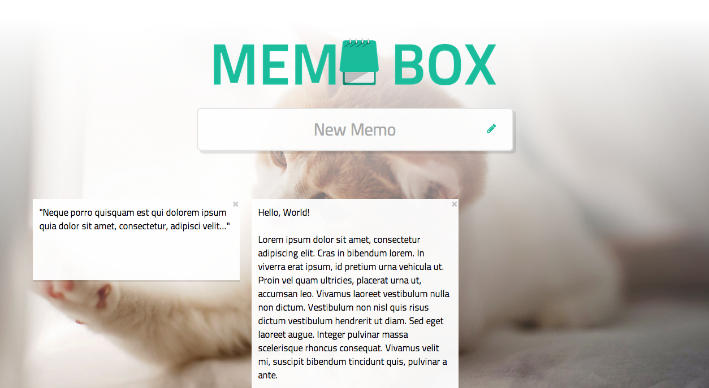

web-memo
========

Dead-simple memo webapp



### Prerequisites
- Ruby *≥ 2.1*
- Node.js *≥ 0.10*
- xz

### Instructions
Frontend:
```bash
cd client/

yarn            # Download dependencies
yarn webpack    # Build front-end codes
```

Backend:
```bash
cd server/

bundle          # Download dependencies
bundle exec run # Start server at 0.0.0.0:9494
```

Backup DB:
```bash
cd server/db/

# Make a new backup
./save
#   data.db => backups/140403_120000_000
# * 백업 완료!

# Restore the old backup
./load backups/140403_120000_000
#   backups/140403_120000_000 => data.db
# * 복구 완료!
```
